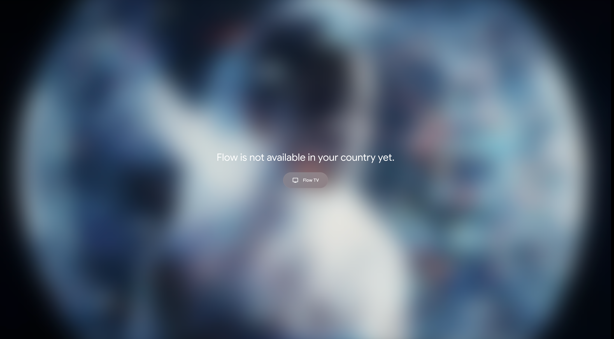

# MJ Hesari Google Flow

افزونهٔ کروم شخصی [جواد حصاری (MJ Hesari)](https://www.mj-hesari.ir/) برای رفع محدودیت دسترسی به [Google Flow](https://flow.google.com/).

> این ابزار برای دور زدن صفحهٔ `/unavailable` و محدودیت جغرافیایی سمت کلاینت طراحی شده است. برای کار درست، به VPN با IP ثابت کشورهای پشتیبانی‌شده نیاز دارید.

**ریپو:** [github.com/mjhesari/mj-hesari-google-flow](https://github.com/mjhesari/mj-hesari-google-flow)

---

## این صفحه برای چیست؟

اگر هنگام باز کردن [flow.google.com](https://flow.google.com/) با یکی از پیام‌های زیر روبه‌رو شدید، همین افزونه برای رفع همان محدودیت ساخته شده است.

### ۱) محدودیت جغرافیایی

> **Flow is not available in your country yet.**



این همان صفحهٔ `/unavailable` (و مسیرهای مشابه مثل `/unsupported-country`) است. با فعال‌کردن افزونه + VPN با IP ثابت، می‌توانید از این صفحه عبور کنید و وارد Flow شوید.

### ۲) خطای دسترسی / ریدایرکت `/?pli=1`

> **It looks like you don't have access to Flow.**

پارامتر `pli` در سرویس‌های گوگل معمولاً یعنی «Previously Logged In» (تأیید نشست/اکانت). Flow وقتی entitlement سمت کلاینت fail شود، به `/?pli=1` می‌رود و همین صفحه را نشان می‌دهد.

افزونه این کارها را می‌کند:
- پارامتر `pli` را از URL برمی‌دارد
- صفحهٔ access-denied را تشخیص می‌دهد و یک‌بار داده‌های سایت را پاک می‌کند
- دکمهٔ **بازنشانی کامل Flow** در پنل (کوکی + localStorage + IndexedDB)

---

## پیش‌نیاز

- مرورگر **Google Chrome** نسخهٔ ۱۱۱ یا بالاتر
- **VPN** با IP ثابت از کشور غیرتحریمی (مثلاً ترکیه، آلمان، امارات)
- اکانت Google که به Flow دسترسی دارد (در صورت نیاز اشتراک Google AI Pro / Ultra)

---

## نصب سریع

### ۱) دانلود پروژه

```bash
git clone https://github.com/mjhesari/mj-hesari-google-flow.git
cd mj-hesari-google-flow
```

یا از گیت‌هاب دکمهٔ **Code → Download ZIP** را بزنید و فایل را از حالت فشرده خارج کنید. پوشه باید دقیقاً به نام `mj-hesari-google-flow` باشد.

### ۲) نصب در کروم

1. در نوار آدرس بروید به: `chrome://extensions`
2. گوشهٔ بالا-راست، **Developer mode** را روشن کنید
3. روی **Load unpacked** کلیک کنید
4. پوشهٔ `mj-hesari-google-flow` را انتخاب کنید
5. آیکون **MJ Hesari Flow** را در نوار ابزار پین کنید

---

## طرز استفاده

| مرحله | کار |
|------|-----|
| ۱ | VPN را روشن کنید (کشور غیرتحریمی + **IP ثابت**) |
| ۲ | روی آیکون افزونه کلیک کنید |
| ۳ | سوییچ **فعالسازی ابزار** را روشن کنید |
| ۴ | روی **بازکردن گوگل فلو** بزنید |
| ۵ | اگر صفحهٔ محدودیت (`/unavailable`) بود، **بارگذاری دوباره گوگل فلو** را بزنید |
| ۶ | اگر به `/?pli=1` یا «don't have access» رفت، **بازنشانی کامل Flow** را بزنید |
| ۷ | یک‌بار صفحه را رفرش کنید تا پچ اعمال شود |

### وضعیت‌های پنل

| وضعیت | معنی |
|------|------|
| **ابزار روشن است** | افزونه فعال شده؛ تب Flow را رفرش کنید |
| **ابزار روی این تب فعال است** | محدودیت سمت کلاینت دور زده شد |
| **نیاز به آپدیت** | ساختار پاسخ گوگل عوض شده؛ افزونه را آپدیت کنید |
| **خطا در ارتباط** | اینترنت یا دسترسی به سرور spec را چک کنید |

### نکات مهم

- بدون VPN درست، حتی با افزونه هم ممکن است Flow کار نکند
- بعد از هر آپدیت کد، در `chrome://extensions` روی **Reload** بزنید
- اگر روی `/unavailable` ماندید، دکمهٔ بارگذاری دوباره مسیر را به ریشه برمی‌گرداند
- اگر به `/?pli=1` پرتاب شدید، افزونه سعی می‌کند خودکار بازنشانی کند؛ در غیر این صورت دکمهٔ پنل را بزنید
- افزونه را فقط روی `flow.google.com` استفاده کنید

---

## امکانات

- فعال / غیرفعال کردن ابزار از پنل
- پچ پاسخ‌های `batchexecute` روی **XHR** و **fetch** (بدون race روی رفرش)
- ریدایرکت خودکار از `/unavailable` و `/unsupported-country`
- حذف پارامتر `pli` و بازیابی از صفحهٔ «don't have access»
- بازنشانی کامل داده‌های `flow.google.com` (کوکی + حافظهٔ محلی)
- پنل برندشده با لینک‌های [MJ Hesari](https://www.mj-hesari.ir/#contact)

---

## ساختار پروژه

```text
mj-hesari-google-flow/
├── manifest.json   # تنظیمات افزونه (Manifest V3)
├── app.js          # service worker — ثبت اسکریپت و دریافت spec
├── engine.js       # موتور پچ داخل صفحهٔ Flow (MAIN world)
├── link.js         # پل بین افزونه و صفحه برای ارسال spec
├── stat.js         # گزارش وضعیت به پنل
├── panel.html      # UI پنل
├── panel.css       # استایل برند MJ Hesari
├── panel.js        # منطق پنل
├── assets/         # آیکون‌ها، برندمارک، فونت و تصویر صفحهٔ خطا
│   └── errorpage.png  # اسکرین صفحهٔ «not available in your country»
└── README.md       # همین راهنما
```

---

## توسعه

- حداقل کروم: **111**
- Manifest: **v3**
- بعد از تغییر فایل‌ها، افزونه را در `chrome://extensions` ریلود کنید

```bash
# تست لود شدن موتور پچ (Node)
node -e "require('./engine.js')"
```

---

## لینک‌ها

| | |
|--|--|
| ریپو | [mj-hesari-google-flow](https://github.com/mjhesari/mj-hesari-google-flow) |
| سایت | [mj-hesari.ir](https://www.mj-hesari.ir/) |
| تماس | [mj-hesari.ir/#contact](https://www.mj-hesari.ir/#contact) |
| تلگرام | [@Mjhe3ari](https://t.me/Mjhe3ari) |
| اینستاگرام | [hesari.dev](https://instagram.com/hesari.dev) |
| گیت‌هاب | [mjhesari](https://github.com/mjhesari) |
| ایمیل | [hesarimj@gmail.com](mailto:hesarimj@gmail.com) |

---

## سلب مسئولیت

این پروژه آموزشی / شخصی است و مسئولیتی در قبال تغییر سیاست‌های Google یا قطع دسترسی ندارد. استفاده مطابق قوانین محلی و شرایط سرویس Google بر عهدهٔ کاربر است.

---

Made by [MJ Hesari](https://www.mj-hesari.ir/) · Full Stack Developer
